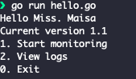

<h1 align="center">Welcome to website monitoring 🔎</h1>
<p>
  <a href="https://www.npmjs.com/package/website monitoring" target="_blank">
    
  </a>
  <a href="https://twitter.com/maisamaximo_" target="_blank">
    
  </a>
</p>

##### This is a simple project applying the basic knowledge of GO (golang).
The purpose of the application is to check if the sites pre-defined in the sites.txt file are working (statuscode 200) or if they have a problem.

The system records logs with time, date and monitoring status.





## Clone 

```sh
git clone https://github.com/maisamaximo/website_monitoring.git
```

## Run

```sh
go run hello.go
```

## Author

👤 **Maisa Maximo**

* Twitter: [@maisamaximo_](https://twitter.com/maisamaximo_)
* Github: [@maisamaximo](https://github.com/maisamaximo)
* LinkedIn: [Maisa Maximo](https://www.linkedin.com/in/maisa-maximo-ferreira/)

## Show your support

Give a ⭐️ if this project helped you!

***
_This README was generated with ❤️ by [readme-md-generator](https://github.com/kefranabg/readme-md-generator)_